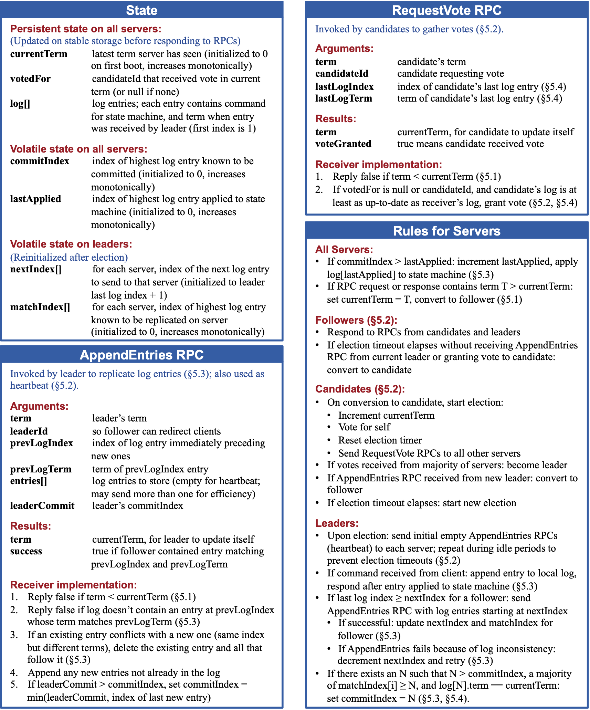
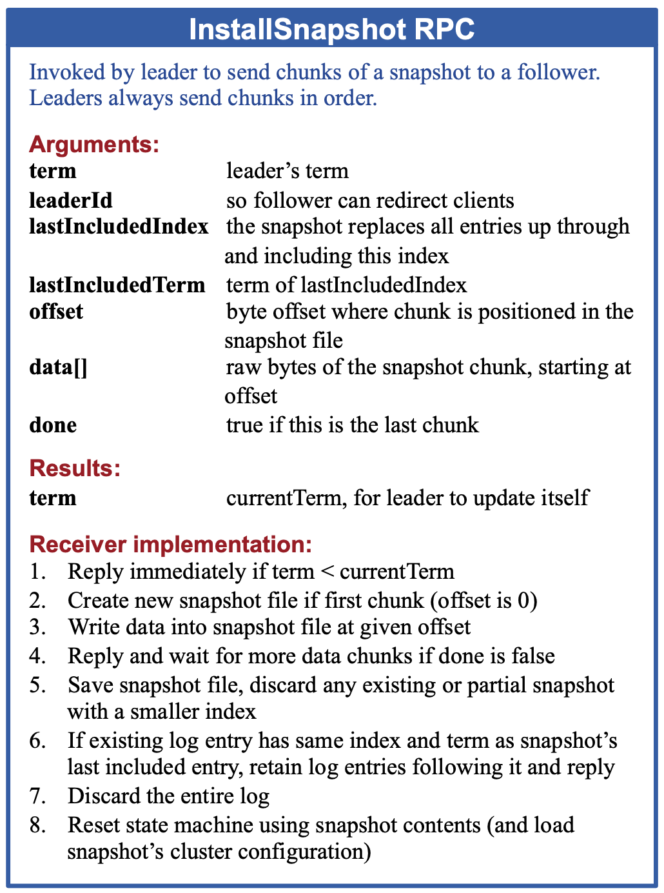

# Raft KV数据库

## 总览

本项目基于Raft共识协议实现了一个强一致性的KV数据库，同时实现了数据库的分片和动态迁移功能。 Raft协议是工程上使用比较广泛的分布式协议，并且相比同为共识算法的Paxos更加易懂。 本项目基于[Raft(extended)论文](https://pages.cs.wisc.edu/~remzi/Classes/739/Spring2004/Papers/raft.pdf)的描述实现了Raft共识算法，并以此为基础在上层实现了支持分片的KV数据库，达到了线性读写的强一致性。

本项目主要分为3个部分：

* Raft协议层：`src/raft`中实现
* 基于Raft协议层的分片元数据管理服务：`src/shardctrler`中实现
* 基于Raft协议层的分片读写服务：`src/shardkv`中实现

总体视图如下：


分片元数据管理服务类似于GFS中Master的角色，记录了从服务开始以来所有版本的配置，每一个版本的配置记录了整个服务中的所有群组以及其内的机器，还记录了分片所属的群组，Client和KV Server可以使用Query接口查询任意版本的配置信息，Admin可以通过Join、Leave、Move接口生成新版本的配置，接口描述如下：
* Query(cid)：查询第cid版本的配置信息
* Join(gid):加入id为gid的KV组并均衡shard产生新配置
* Leave(gid):下掉id为gid的KV组并均衡shard产生新配置
* Move(shardId, gid):将分片id为shardId的分片迁移至gid代表的KV组产生新配置

分片读写服务则负责其上所有分片的读写(Get/Put/Append接口)，同时由于分片配置的变更，需要定时Query元数据管理服务，获得当前配置的下一个配置，有新的配置时，依据新老配置的差异向负责分片的旧Group发送拉取分片PullShard的请求，并在拉取完成后发送删除分片DeleteShard的请求，接口描述如下：
* Get(key)：获得key对应的value
* Put(key, val)：将key的值设置为val
* Append(key, val)：将key的值追加val
* PullShard(cid, shardIds)：告知所处的配置版本cid，需要拉取shardIds中分片id对应的分片数据
* DeleteShard(cid, shardIds)：已经拉取完成，可以让旧group删除shardIds中分片id对应的数据，释放内存

以上所有与写相关的操作，因为可能有网络不稳定、重传等情况发生，要在服务端做幂等过滤，本项目通过记录所有客户端id的最大命令Index来过滤已经处理过的请求并直接返回结果，进而达到线性读写，不会因为网络问题产生roll back的现象，详见后文。

所有服务执行任何操作都需要先在Raft层达成共识，以此达到强一致性，服务通过Start函数向Raft层发起对某个操作达成共识的请求，Raft层通过一个管道告知服务操作已被提交，同时也提供了相应的函数来为服务的状态做快照，详见后文。

## Raft协议层

Raft协议的实现主要依据原论文中的描述，RPC接口的汇总描述如原论文的Figure 2所示：


### 节点状态定义

```go
type Raft struct {
	mu        sync.Mutex          //本节点内读写字段的互斥锁，防止竞争
	peers     []*labrpc.ClientEnd //共识组的所有成员RPC客户端
	persister *Persister          //持久化本节点状态的存储器
	me        int                 //本节点在共识组中的编号
	dead      int32               //可以被Kill()函数设置，标记宕机，方便测试

	currentTerm int        //本节点所处Term(变更需要持久化)
	votedFor    int        //本节点投票给候选者的编号，-1代表没投(变更需要持久化)
	log         []LogEntry //存储所有log项(变更需要持久化)，log[0]存储快照的lastIncludedTerm、lastIncludedIndex
	commitIndex int        //本节点已经commit的log项索引
	lastApplied int        //本节点已经apply的log项索引
	nextIndex   []int      //本节点做为Leader时，用于管理给某个Follower下一个该发的日志项索引
	matchIndex  []int      //本节点做为Leader时，用于管理已知某个Follower已经接收到的最大日志项索引

	state          State         //当前角色，Leader、Follower、Candidate
	applyCh        chan ApplyMsg //向上层服务发送已commit日志项的管道
	applyCond      *sync.Cond    //用于异步激活applier
	replicateConds []*sync.Cond  //用于异步激活对应某个Follower的replicator

	electionTimer  *time.Timer //发起选举计时器
	heartbeatTimer *time.Timer //leader发送心跳计时器
}
```

### Leader选举
为了初始时或者Leader宕机时能够及时选出新的Leader，在启动每个节点的时候，会为每个节点启动一个ticker协程，做为Follower的节点，如果长时间没有收到Leader的心跳或者其他消息，在一定时间后，electionTimer会触发本节点的ticker发起新一轮的选举，切换状态到Candidate，并启动一个协程，异步地向其他所有节点发送RequestVote请求，并在获得一半以上选票后成为leader。该部分实现在`src/raft/raft.go`的ticker和startElection函数中。

RequestVote接口用于Candidate向其他节点请求选举投票，主要依据原论文描述实现，详见`src/raft/raft.go`的RequestVote接口。

### 日志项复制
为了Leader能够不阻塞地向所有Follower同步已有的log项，采用了为每个Follower都创建一个协程的方式，每个协程只负责自己对应的Follower的日志项复制，通过检查对应Follower的nextIndex和Leader拥有的最大日志项Index决定需不需要向Follower同步日志项，以及同步多少日志项。为了避免资源浪费，在不满足同步条件时，协程会进入阻塞状态，每当Leader有新的日志项时便会被唤醒检查是否需要同步。该部分实现在`src/raft/raft.go`的replicator函数中。

AppendEntries接口用于Leader向Follower复制日志，主要依据原论文描述实现，详见`src/raft/raft.go`的AppendEntries接口。

replicator函数通过调用sendOneEntryToPeer函数真正的向Follower发送数据，sendOneEntryToPeer函数中会根据要发的日志项索引决定是发送快照(InstallSnapshot)还是日志项(AppendEntries)，并构造相应的请求参数，同时对于AppendEntries还会通过回复信息实时检查是否大于一半的Follower接收到日志项，进而决定能否提交。该部分实现在`src/raft/raft.go`的sendOneEntryToPeer函数中。

假如Leader提交(commit)日志项的同时应用(apply)了日志项，那么由于复制日志项有多个并发协程，可能同一时刻向上层服务的管道中塞了多个相同的日志项，为了分离日志项的提交(commit)和应用(apply)，剥离出了applier协程，通过检查已apply的索引和已commit的索引，不断追赶其间的日志项，同样为了避免资源浪费，在不满足同步条件时，协程会进入阻塞，当commitIndex有更新时将唤醒applier检查，从而不断地向上层服务apply日志项。该部分实现在`src/raft/raft.go`的applier函数中。

### 持久化
与论文中描述的一致，Raft节点的currentTerm、votedFor、log三个字段是需要持久化的，因此所有对三个字段进行修改的地方都需要持久化修改，持久化部分实现在`src/raft/raft.go`的persist函数中。

### 快照
同时为了避免基本Raft算法日志项无限增长的问题，本项目实现了快照功能，其中节点重启从leader快速恢复到最新状态的安装快照RPC接口如原论文的Figure 13所示：

上层服务可以通过Snapshot函数为将上层服务状态形成的快照发给Raft节点，函数中Raft节点可以截断日志长度，释放内存，并将快照和自己的状态进行持久化，达到节约内存的效果。该部分实现在`src/raft/raft.go`的Snapshot函数中。

InstallSnapshot接口用于Leader向Follower发送快照，接受方会向上层服务管道发送快照快速达到快照状态，主要依据原论文描述实现，详见`src/raft/raft.go`的InstallSnapshot接口。

## 分片元数据管理服务

### 服务端

#### 节点状态定义
```go
type ShardCtrler struct {
	mu      sync.Mutex         //本节点内读写字段的互斥锁，防止竞争
	me      int                //本节点在共识组中的编号
	rf      *raft.Raft         //本节点下的Raft节点
	applyCh chan raft.ApplyMsg //接收Raft节点apply的日志项

	configs      []Config                   //所有版本的配置信息
	duplicateMap map[int64]LastContext      //存每一个clientId上一个请求的commandId和reply
	waitApply    map[int]chan *CommandReply //每一次Command请求，用来等待apply后返回给客户端
}
```

#### 处理命令
在服务端的实现中，把Query、Join、Leave、Move融合在一个Command接口中，通过op字段区分具体操作，Command接口的实现中会将各种操作打包成一个操作结构体，通过Start函数发给Raft节点发起共识，并且新建一个waitApply的管道等待共识完成并且apply操作，当等待完成或者超时后，便可以将操作执行结果返回给客户端。该部分实现在`src\shardctrler\server.go`的Command接口。

#### 应用命令
服务端节点在启动时会启动一个applier协程用于接收Raft层向管道应用的日志项，这里每拿到一个日志项，将区分该操作的类型(Query、Join、Leave、Move)，交给不同的函数进行应用，应用完成后，则构造回复给等待的waitApply管道，从而正式完成一个请求。该部分实现在`src\shardctrler\server.go`的applier函数。

### 客户端
客户端的每一个请求，都通过rpc包的Call函数，不断循环尝试直到成功，每次尝试失败都会换一台机器重试。该部分实现在`src\shardctrler\client.go`中。

## 分片读写服务

### 服务端

#### 节点状态定义
```go
type ShardKV struct {
	mu           sync.Mutex
	me           int
	rf           *raft.Raft
	applyCh      chan raft.ApplyMsg
	dead         int32
	make_end     func(string) *labrpc.ClientEnd
	gid          int //所处Group id
	maxraftstate int //制作快照阈值
	
	mck         *shardctrler.Clerk               //Controller客户端
	config      shardctrler.Config               //当前配置
	lastconfig  shardctrler.Config               //上一个配置
	lastApplied int                              //上一个applied entry索引
	serverState [shardctrler.NShards]*ShardState //每个分片的状态
	waitApply   map[int]chan *GeneralReply       //每一次请求，用来等待apply后返回给客户端
}
```

#### 分片状态机
为了清晰管理分片的服务、迁移、删除，定义了分片的一系列状态，如下：
```go
//shard状态机，从头到尾依次转移状态，再回到Init
const (
	ShardInit     ShardMode = iota //空状态
	ShardPulling                   //数据拉取中
	ShardDeleting                  //数据拉取完成，删除远端数据源中
	ShardServing                   //正常服务中
	ShardPulled                    //被拉取中
)
```

#### 处理读写命令
在服务端的实现中，把Get、Put、Append融合在一个KVCommand接口中，通过op字段区分具体操作，KVCommand接口的实现中会将各种操作打包成一个操作结构体，通过Start函数发给Raft节点发起共识，并且新建一个waitApply的管道等待共识完成并且apply操作，当等待完成或者超时后，便可以将操作执行结果返回给客户端。该部分实现在`src\shardkv\server.go`的KVCommand接口。

#### 更新分片配置
如果下层的Raft节点是Leader，那么本服务节点会启动协程updater，定期负责向元数据管理服务Query新的配置，这里会检查是否具备更新配置的前置条件，需要已完成本轮配置，即所有分片状态处于Init或者Serve，符合条件且有新的配置，则向Raft层发起op为Config的共识，并且新建一个waitApply的管道等待共识完成并且apply操作，当等待完成或者超时后返回。该部分实现在`src\shardkv\server.go`的updater函数。

applier协程在遇到Config操作时，会更新服务器状态中的config，并且通过新老配置的差异更新分片所处状态(Init->Serve、Init->Pulling、Serve->Pulled)，该部分实现在`src\shardkv\server.go`的applyConfigCommand函数。

#### 处理拉取分片命令
如果下层的Raft节点是Leader，那么本服务节点会启动协程puller，定期检查是否有分片状态处于Pulling，对于处在Pulling状态的分片，则启动协程向对应的Group发起拉取分片的请求，将回复中的分片状态打包成op为Pull的操作向Raft层发起共识，并且新建一个waitApply的管道等待共识完成并且apply操作，当等待完成或者超时后返回。该部分实现在`src\shardkv\server.go`的puller函数。

applier协程在遇到Pull操作时，会更新服务器状态中对应分片的状态，并且更新分片所处状态(Pulling->Deleting)，该部分实现在`src\shardkv\server.go`的applyPullCommand函数。

PullShard被调用者会根据参数配置版本号ConfigNum判断是否将对应分片内容发送给调用方，符合则将分片内容返回。该部分实现在`src\shardkv\server.go`的PullShard接口。

#### 处理删除分片命令
如果下层的Raft节点是Leader，那么本服务节点会启动协程deleter，定期检查是否有分片状态处于Deleting，对于处在Deleting状态的分片，则启动协程向对应的Group发起删除分片的请求，将成功的回复打包成op为Serve的操作向Raft层发起共识，并且新建一个waitApply的管道等待共识完成并且apply操作，当等待完成或者超时后返回。该部分实现在`src\shardkv\server.go`的deleter函数。

applier协程在遇到Serve操作时，会更新分片所处状态(Deleting->Serve)，该部分实现在`src\shardkv\server.go`的applyServeCommand函数。

DeleteShard被调用者会根据参数配置版本号ConfigNum判断是否将对应分片内容删除，符合则将对应的分片ids打包成op为Delete的操作向Raft层发起共识，并且新建一个waitApply的管道等待共识完成并且apply操作，当等待完成或者超时后返回。。该部分实现在`src\shardkv\server.go`的DeleteShard接口。

applier协程在遇到Delete操作时，会释放对应分片数据的内存，并且更新分片所处状态(Pulled->Init)，该部分实现在`src\shardkv\server.go`的applyDeleteCommand函数。

#### 空命令
如果下层的Raft节点是Leader，那么本服务节点会启动协程emptySender，定期检查当前Raft节点是否尚未有本任期内的日志项，没有则提交一个op为Empty的空操作，避免活锁。该部分实现在`src\shardkv\server.go`的emptySender函数。

极端情况下比如group中三个主机A、B、C，A为leader，raft层的日志假设为[1,2]，A commit并且apply了2，但是B和C还没有， 这时整个group宕机了，重启后B成为新leader，虽然raft层的日志也为[1,2]但是由于不知道2是否已被提交，raft层会一直等待本任期的entry被提交顺带将之前任期的entry提交，假如说2在本服务里是把shard的mode从Pulled设置为Init，A其实已经apply所以可以进一步的拉取新的config，但是B由于一直等待本任期的entry，不敢commit以及apply这个之前任期的entry，所以那个shard会一直处于Pulled状态，因此无法更进一步拉取新的配置，形成了活锁，因此上任后发送一个空操作可以避免这种情况，快速地将之前任期的entry一并commit以及apply。

#### 应用命令
服务端节点在启动时会启动一个applier协程用于接收Raft层向管道应用的日志项，这里每拿到一个日志项，将区分该操作的类型(Get、Put、Append、Config、Pull、Serve、Delete、Empty)，交给不同的函数进行应用，应用完成后，则构造回复给等待的waitApply管道，从而正式完成一个请求。同时applier会检查下层Raft状态的大小，超过阈值则进行快照的制作。该部分实现在`src\shardkv\server.go`的applier函数。

### 客户端